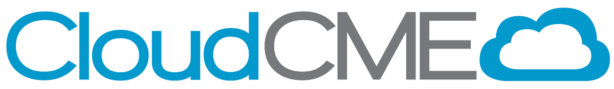

# Kory Munk
### Senior Developer | [CloudCME®](https://cloud-cme.com)

<!---
KMunk/KMunk is a ✨ special ✨ repository because its `README.md` (this file) appears on your GitHub profile.
You can click the Preview link to take a look at your changes.
--->
